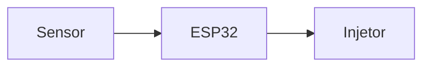

# Guia de Documentação

Este guia explica como escrever e publicar documentação neste site. Ele é para membros do TechGears que vão contribuir com as seções ainda em aberto.

## Tecnologia utilizada

Este site usa [Docusaurus](https://docusaurus.io/) — um gerador de sites estáticos em React mantido pelo Meta. As páginas são escritas em **Markdown** (`.md`) ou **MDX** (`.mdx`, Markdown com JSX).

O código-fonte do site fica em `docs-site/` no repositório. Ao fazer push na `main`, o GitHub Actions publica automaticamente no GitHub Pages.

## Onde ficam os arquivos

```
docs-site/
├── docs/              # ← Escreva aqui suas páginas de documentação
│   ├── introducao.md
│   ├── guia-documentacao.md
│   ├── teoria/        # (a criar) Teoria do motor, sensores, lambda
│   ├── hardware/      # (a criar) Diagrama de blocos, componentes, montagem
│   ├── firmware/      # (a criar) Arquitetura, sensores, cálculo, ignição
│   ├── calibracao/    # (a criar) Guia de calibração, mapa, lambda
│   └── decisoes/      # (a criar) ADRs e escopo da V1
├── blog/              # Diário técnico — uma entrada por semana (crônica)
├── src/
│   ├── pages/         # Página inicial (index.tsx)
│   └── css/custom.css # Identidade visual TechGears
├── static/            # Imagens e assets estáticos
└── docusaurus.config.ts
```

## Como criar uma nova página

1. Crie um arquivo `.md` dentro de `docs-site/docs/` (ou numa subpasta para organizar)
2. Adicione o frontmatter no topo:

```md
---
id: minha-pagina
title: Título da Página
sidebar_position: 3
---

# Título da Página

Conteúdo aqui...
```

3. Se a página estiver numa nova subpasta, adicione a categoria em `docs-site/sidebars.ts`
4. Faça commit, push e o deploy acontece automaticamente

## Convenções de escrita

- **Português Brasil** em toda a documentação
- Use cabeçalhos para estruturar (H1 = título, H2 = seções, H3 = subseções)
- Prefira **listas e tabelas** a parágrafos longos para informação técnica
- Inclua **links para fontes** ao mencionar conceitos de referência
- Diagramas vão em Mermaid (renderizados diretamente no browser):

```md

```

## ADRs

Decisões de arquitetura importantes devem ser documentadas como ADRs (Architecture Decision Records) em `docs-site/docs/decisoes/`. Use o template:

```md
---
id: ADR-XXX-nome
title: ADR-XXX — Título da Decisão
---

# ADR-XXX — Título da Decisão

**Data:** AAAA-MM-DD | **Status:** Proposto / Aceito / Substituído

## Contexto
Por que precisamos tomar essa decisão?

## Decisão
O que decidimos fazer.

## Justificativa
Por que essa opção e não as alternativas?

## Consequências
O que muda com essa decisão? Trade-offs.
```

## Diário técnico (blog)

Use o blog do Docusaurus como diário de desenvolvimento — pelo menos uma entrada por semana documentando o progresso, problemas encontrados e decisões tomadas. Os posts ficam em `docs-site/blog/`.

Para criar um post:

```
docs-site/blog/2026-05-28-primeira-entrada.md
```

```md
---
title: Primeira semana — estrutura do repositório
authors: [felisak]
tags: [infra, ecu]
---

Descrição do que foi feito, problemas e próximos passos.

<!-- truncate -->

Detalhes completos aqui...
```

Configure os autores em `docs-site/blog/authors.yml`.

## Rodando localmente

```bash
cd docs-site
npm install
npm start
```

O site abre em `http://localhost:3000/programmable-ecu/`.

## Deploy automático

O arquivo `.github/workflows/deploy-docs.yml` configura o deploy automático:
- **Trigger:** push na branch `main` com mudanças em `docs-site/**`
- **Build:** `npm run build` dentro de `docs-site/`
- **Publicação:** GitHub Pages em `https://techgearsinteli.github.io/programmable-ecu/`

Para ativar o GitHub Pages pela primeira vez, acesse **Settings → Pages → Source → GitHub Actions** no repositório.
