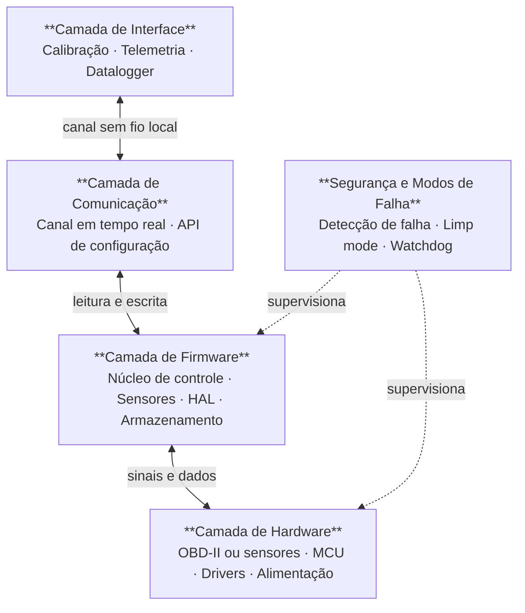
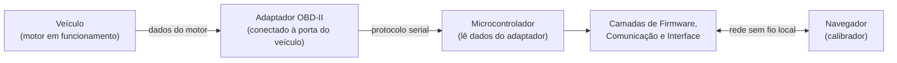
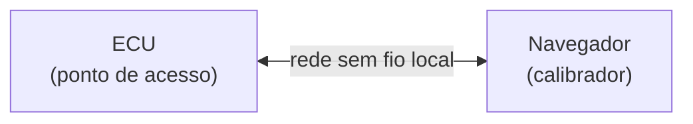

# Arquitetura do Sistema

<div style={{textAlign: 'justify'}}>

&emsp;A Programmable ECU é organizada em quatro camadas interdependentes: **hardware**, **firmware**, **comunicação** e **interface**. Cada camada tem responsabilidade única e se comunica exclusivamente com a camada adjacente, garantindo isolamento, testabilidade e facilidade de evolução independente. Além dessas camadas, um módulo transversal de **segurança e modos de falha** atua em tempo real sobre todas elas.

&emsp;Este documento descreve não só o que o sistema é, mas como ele será construído, na ordem em que as decisões e implementações fazem sentido para um time universitário sem laboratório próprio, sem equipamentos de eletrônica disponíveis e sem orçamento fixo.

## Visão Geral



## Princípios de Design

&emsp;Três princípios guiam todas as decisões arquiteturais da ECU:

**Isolamento por camadas.** Nenhuma camada acessa internals de outra. A interface não lê sensores diretamente; o firmware não conhece detalhes do protocolo de comunicação. Isso permite testar, substituir e evoluir cada parte de forma independente, o que é especialmente importante para um time onde diferentes pessoas trabalham em partes diferentes ao mesmo tempo.

**Tempo real como restrição fundamental.** O núcleo de controle opera com restrições temporais rígidas: o acionamento de injetores e bobinas precisa ser calculado e executado dentro de uma janela de poucos microssegundos a cada passagem de dente no virabrequim. Qualquer operação que possa bloquear esse ciclo, como comunicação de rede ou escrita em memória, é executada em contexto separado, de forma assíncrona.

**Segurança por padrão.** Em caso de dúvida, a ECU conserva. Sensores com leituras inválidas, memória corrompida ou firmware travado não resultam em comportamento indefinido: há uma resposta determinística definida para cada modo de falha.

## Estratégia de Desenvolvimento em Fases

&emsp;Construir uma ECU do zero sem infraestrutura de laboratório coloca um problema prático imediato: não é possível testar o software enquanto o hardware ainda não existe, e não é possível validar o hardware sem software funcionando. Para quebrar esse ciclo, o desenvolvimento é dividido em duas fases que permitem progresso real mesmo antes de qualquer solda ou PCB.

### Fase 1: Leitura via porta OBD-II

&emsp;Todo veículo fabricado a partir de 1996 possui uma porta padronizada de diagnóstico chamada OBD-II (On-Board Diagnostics, segunda geração). Essa porta expõe, em tempo real, dados internos da ECU original do veículo: rotação do motor, temperatura do arrefecimento, posição da borboleta, pressão do coletor, leituras da sonda lambda, temperatura do ar admitido e carga calculada do motor. São exatamente os mesmos dados que a ECU própria precisará ler dos sensores diretos na fase seguinte.

&emsp;Um adaptador OBD-II conectado a essa porta permite que o microcontrolador leia essas grandezas sem nenhum circuito adicional, nenhuma soldagem e nenhum sensor próprio. Com isso, é possível:

- Desenvolver e validar o módulo de sensores do firmware com dados reais de um motor real
- Construir e testar toda a camada de comunicação e a interface web com telemetria real
- Implementar e calibrar os mapas de combustível e ignição, ainda que sem controle de injeção
- Identificar problemas de software muito antes de fabricar qualquer hardware

&emsp;A Fase 1 permite que o time avance meses no desenvolvimento de software enquanto o projeto de hardware amadurece em paralelo. O diagrama abaixo mostra como a arquitetura se organiza nessa fase:



&emsp;Os dados disponíveis via OBD-II e sua correspondência com os sensores da ECU própria são:

<div align="center">
<small><strong style={{fontSize: '12px'}}>Quadro 1: Correspondência entre dados OBD-II e sensores diretos</strong></small>

| Dado OBD-II                         | Sensor direto equivalente (Fase 2)     | Grandeza                      |
| ----------------------------------- | -------------------------------------- | ----------------------------- |
| Engine RPM (PID 0x0C)               | CKP (sensor de posição do virabrequim) | Rotação em RPM                |
| Coolant Temperature (PID 0x05)      | CLT (sensor de temperatura do líquido) | Temperatura em °C             |
| Throttle Position (PID 0x11)        | TPS (sensor de posição da borboleta)   | Abertura em %                 |
| Intake Manifold Pressure (PID 0x0B) | MAP (sensor de pressão do coletor)     | Pressão em kPa                |
| Intake Air Temperature (PID 0x0F)   | IAT (sensor de temperatura do ar)      | Temperatura em °C             |
| O2 Sensor Voltage (PID 0x14)        | Sonda lambda                           | Tensão proporcional à mistura |
| Calculated Engine Load (PID 0x04)   | Calculado internamente pelo firmware   | Carga relativa em %           |

<small style={{marginTop: '4px', fontSize: '10px'}}>Fonte: Material produzido pelo grupo, 2026.</small>

</div>

&emsp;A única limitação da Fase 1 é que o microcontrolador lê os dados, mas não controla nada: não aciona injetores nem bobinas. O veículo continua sendo gerenciado pela ECU original. Isso é intencional e seguro: o time aprende, desenvolve e valida sem risco nenhum ao motor.

### Fase 2: Sensores diretos e controle real

&emsp;Quando o firmware e a interface estiverem maduros e testados com dados OBD-II, o desenvolvimento evolui para o hardware próprio. Nessa fase, o módulo de sensores do firmware é reconfigurado para ler das entradas analógicas e digitais do microcontrolador em vez do adaptador OBD-II. Os dados vêm agora dos sensores instalados diretamente no motor.

&emsp;A vantagem dessa progressão é que toda a lógica de cálculo, calibração, comunicação e interface já foi validada. O esforço da Fase 2 se concentra exclusivamente na eletrônica de hardware e na integração física com o motor.

## Camada de Hardware

&emsp;A camada de hardware compreende todos os componentes físicos do sistema. Na Fase 1, ela se resume ao microcontrolador e ao adaptador OBD-II. Na Fase 2, inclui os circuitos completos de sensores, drivers e alimentação.

### Entrada de dados

**Fase 1 (OBD-II).** O adaptador OBD-II é conectado à porta de diagnóstico do veículo e se comunica com o microcontrolador via interface serial. Não requer nenhuma montagem eletrônica. O microcontrolador envia comandos de consulta ao adaptador e recebe os valores de cada grandeza do motor. O processo para começar essa fase é:

1. Adquirir um adaptador OBD-II compatível com comunicação serial (existem versões de baixo custo amplamente disponíveis)
2. Conectar o adaptador à porta OBD-II do veículo (localizada abaixo do painel, próxima ao volante em quase todos os carros)
3. Conectar o adaptador ao microcontrolador via cabo
4. Implementar o driver de comunicação serial no firmware para enviar consultas e interpretar as respostas
5. Validar que os valores lidos correspondem ao que um aplicativo OBD-II padrão mostraria para o mesmo veículo

**Fase 2 (sensores diretos).** Na Fase 2, os sensores são instalados no motor e conectados às entradas do microcontrolador. Os sensores que fornecem ao microcontrolador as grandezas físicas necessárias para o cálculo do controle do motor são:

<div align="center">
<small><strong style={{fontSize: '12px'}}>Quadro 2: Sensores de entrada da ECU (Fase 2)</strong></small>

| Sensor                       | Grandeza medida                         | Uso no sistema                                                                |
| ---------------------------- | --------------------------------------- | ----------------------------------------------------------------------------- |
| CKP (Posição do virabrequim) | Velocidade angular e posição do motor   | Cálculo de rotação (RPM), sincronismo de injeção e ignição                    |
| MAP (Pressão do coletor)     | Pressão absoluta no coletor de admissão | Principal indicador de carga do motor; eixo vertical do mapa de calibração    |
| TPS (Posição da borboleta)   | Abertura percentual da borboleta        | Indica demanda instantânea do condutor; usado em enriquecimento de aceleração |
| CLT (Temperatura do líquido) | Temperatura do arrefecimento do motor   | Correções de partida a frio e proteção por sobretemperatura                   |
| IAT (Temperatura do ar)      | Temperatura do ar admitido              | Correção de densidade do ar na mistura                                        |
| Sonda lambda                 | Teor de oxigênio nos gases de escape    | Realimentação para controle de malha fechada da mistura ar-combustível        |

<small style={{marginTop: '4px', fontSize: '10px'}}>Fonte: Material produzido pelo grupo, 2026.</small>

</div>

&emsp;O processo para essa transição é:

1. Definir o conector e o mapeamento de pinos do microcontrolador para cada sensor
2. Desenhar o esquemático completo com os circuitos de condicionamento de sinal de cada sensor
3. Montar o circuito em protoboard e validar as leituras com um multímetro antes de qualquer PCB
4. Após validação em protoboard, fabricar a PCB
5. Instalar os sensores no motor e cabear até a ECU

### Microcontrolador

&emsp;O microcontrolador é o processador central da ECU. Ele executa o firmware em tempo real, gerencia todas as interrupções dos sensores, comanda os drivers de saída e hospeda o ponto de acesso sem fio que permite a conexão da interface de calibração. A escolha do microcontrolador será definida no decorrer do projeto, considerando requisitos de temporização, periféricos disponíveis, conectividade sem fio integrada e custo.

&emsp;O processo de familiarização com o microcontrolador deve acontecer antes de qualquer outra etapa de firmware. Isso inclui aprender a gerar pulsos de duração exata usando temporizadores de hardware (não usando funções de espera, que bloqueiam o processador), ler entradas analógicas com o conversor ADC interno, configurar interrupções externas por borda de sinal e configurar a pilha de rede sem fio para criar um ponto de acesso local.

### Drivers de saída

&emsp;Os drivers amplificam os sinais de controle gerados pelo microcontrolador para os níveis de tensão e corrente exigidos pelos atuadores do motor. Essa etapa é inteiramente da Fase 2, pois requer hardware montado.

- **Drivers de injetor:** acionam os quatro injetores de forma sequencial, com temporização de precisão em microssegundos
- **Drivers de bobina:** geram o pulso de ignição nas bobinas de cada cilindro no momento calculado pelo firmware

&emsp;O processo para validar os drivers antes de conectar ao motor real é testar cada canal com uma carga resistiva no lugar do injetor ou da bobina, verificando com osciloscópio que a duração e o momento do pulso correspondem ao calculado pelo firmware.

### Alimentação e proteção

&emsp;O circuito de alimentação regula a tensão da bateria do veículo para os níveis operacionais do microcontrolador e dos sensores, além de proteger a ECU contra transientes elétricos característicos do ambiente automotivo. O processo para projetar esse circuito envolve mapear as tensões e correntes de cada componente, dimensionar o regulador e adicionar proteções contra inversão de polaridade e picos de tensão típicos de ambientes com motor a combustão.

## Camada de Firmware

&emsp;O firmware é organizado em quatro subcamadas sobrepostas. Essa separação permite testar cada módulo de forma isolada e facilita a substituição da origem dos dados (OBD-II na Fase 1, sensores diretos na Fase 2) sem alterar o restante do código.

### HAL (Abstração de Hardware)

&emsp;A HAL é a subcamada mais próxima do hardware. Ela encapsula todos os acessos diretos aos periféricos do microcontrolador: entradas analógicas, contadores de pulso, temporizadores de alta resolução, portas digitais, interface serial e pilha de rede sem fio. As camadas superiores nunca acessam o hardware diretamente; toda operação passa pela HAL.

&emsp;Na Fase 1, a HAL expõe uma interface de leitura serial para o adaptador OBD-II. Na Fase 2, essa mesma interface é substituída pelos leitores de ADC e pelos contadores de interrupção para os sensores diretos. O restante do firmware não percebe a diferença porque acessa os dados sempre através da mesma abstração.

&emsp;O processo para construir a HAL começa pelos periféricos mais simples (entradas digitais e saídas digitais), avança para os temporizadores de alta resolução e termina com a interface serial e a pilha sem fio. Cada periférico deve ser validado com um teste isolado antes de ser integrado às camadas superiores.

### Módulo de sensores

&emsp;O módulo de sensores é responsável pela leitura contínua das grandezas físicas e por sua conversão para unidades de engenharia (por exemplo, um nível de tensão elétrica convertido em graus Celsius ou kilopascals). Ele consome os dados brutos da HAL e entrega valores já convertidos ao núcleo de controle.

&emsp;Cada canal de sensor é validado continuamente contra faixas de operação esperadas. Quando uma leitura está fora do intervalo aceitável por tempo superior a um limiar configurável, o módulo sinaliza uma falha para o sistema de segurança.

&emsp;O processo para implementar esse módulo começa pela Fase 1, onde os dados chegam já em unidades físicas do adaptador OBD-II. Isso permite validar o módulo inteiro e todas as suas lógicas de conversão e detecção de falha antes de qualquer trabalho com circuitos analógicos. Na Fase 2, apenas a função de leitura de cada canal é substituída; a conversão, a validação e a sinalização de falha permanecem iguais.

### Núcleo de controle

&emsp;O núcleo de controle é o coração da ECU. Ele opera orientado a eventos de posição do virabrequim: a cada pulso do sensor CKP, uma interrupção de alta prioridade dispara o ciclo de cálculo. Na Fase 1, esse ciclo pode ser simulado com base no RPM lido via OBD-II para desenvolver e testar toda a lógica de cálculo antes de ter o sinal CKP real. Dentro do ciclo, os seguintes passos são executados em ordem:

1. **Atualização da posição angular:** o evento CKP atualiza a posição instantânea do motor e recalcula o RPM
2. **Consulta ao mapa de calibração:** o tempo base de injeção é obtido por interpolação bilinear na grade definida pelos eixos de rotação (RPM) e carga (pressão do coletor)
3. **Correções multiplicativas:** o valor base é ajustado por fatores que compensam temperatura do motor, temperatura do ar, enriquecimento por aceleração brusca e partida a frio
4. **Controle de lambda em malha fechada:** um controlador de realimentação compara a mistura medida pela sonda lambda com o valor alvo e ajusta o fator de correção de longo prazo
5. **Cálculo do momento de ignição:** o avanço de ignição é obtido por consulta ao mapa de ignição e ajustado pela condição de operação
6. **Agendamento dos atuadores:** os temporizadores de hardware são programados com os valores calculados, garantindo que injetores e bobinas sejam acionados no ângulo correto, com precisão de microssegundos
7. **Verificação de proteções:** o núcleo aplica limitadores de rotação e temperatura antes de confirmar o acionamento

&emsp;O ciclo inteiro deve completar antes da próxima interrupção CKP. Qualquer operação que não caiba nessa janela, como leitura de sensores analógicos lentos, comunicação de rede ou escrita em memória, é delegada a tarefas assíncronas de menor prioridade.

&emsp;O processo para desenvolver o núcleo de controle começa pela interpolação bilinear nos mapas, que pode ser escrita e verificada completamente fora do microcontrolador, com casos de teste em planilha. Em seguida, o cálculo de injeção e ignição é implementado e validado com entradas fixas antes de ser conectado aos dados reais dos sensores.

### Estrutura dos mapas de calibração

&emsp;Os mapas de combustível e de ignição são tabelas bidimensionais. Cada célula da tabela armazena um valor para uma combinação específica de rotação e carga. Durante a operação, a ECU determina em qual célula o motor está operando e, quando a condição cai entre células, calcula o valor intermediário por interpolação bilinear, garantindo uma resposta suave e contínua em toda a faixa de operação.

```
        Carga (kPa)
        ┌──────────────────────────────────────►
        │  30   40   50   60   70   80   90  100
   ┌────┼────────────────────────────────────────
   │ 900│  8.2  9.1 10.0 11.4 12.8 14.1 15.2 16.0
   │1200│  8.5  9.5 10.8 12.3 13.9 15.2 16.4 17.1
R  │1600│  9.1 10.3 11.8 13.5 15.1 16.8 18.0 18.9
P  │2000│  9.8 11.2 12.9 14.7 16.6 18.4 19.8 20.7
M  │2500│ 10.6 12.3 14.2 16.3 18.4 20.4 22.0 23.0
   │3000│ 11.5 13.4 15.5 17.9 20.2 22.5 24.3 25.4
   │3500│ 12.3 14.5 16.8 19.4 22.0 24.5 26.5 27.7
   ▼4000│ 13.0 15.4 17.9 20.8 23.6 26.3 28.5 29.9
```

<div align="center"><small style={{fontSize: '10px'}}>Figura 1: Exemplo ilustrativo de mapa de combustível (valores em ms de abertura do injetor). Fonte: Material produzido pelo grupo, 2026.</small></div>

&emsp;Na Fase 1, o calibrador pode preencher e ajustar esses mapas com base nos dados reais lidos via OBD-II, aprendendo como o motor responde a diferentes combinações de RPM e carga, mesmo que a ECU ainda não esteja controlando a injeção.

### Armazenamento persistente

&emsp;Os mapas de calibração e os parâmetros do sistema são armazenados em memória não volátil, garantindo que as configurações sobrevivam a desligamentos e reinicializações. A escrita é atômica: uma gravação incompleta não corrompe o mapa em uso. Na inicialização, a integridade dos dados é verificada; se a verificação falhar, o mapa de segurança padrão é carregado em seu lugar.

&emsp;O processo para implementar o armazenamento persistente inclui escolher a região de memória não volátil disponível no microcontrolador, definir o layout de bytes de cada mapa, implementar a escrita atômica com verificação de integridade por soma de verificação e testar a recuperação de dados corrompidos simulando uma interrupção de energia no meio de uma escrita.

## Camada de Comunicação

&emsp;A camada de comunicação expõe os dados internos do firmware para a interface externa sem interferir no funcionamento em tempo real do controle do motor. Ela opera de forma assíncrona, em segundo plano, com isolamento de recursos em relação ao núcleo de controle.

&emsp;Essa camada pode ser construída e validada completamente durante a Fase 1, pois não depende de sensores diretos nem de drivers de atuadores.

### Topologia de rede

&emsp;A ECU opera como ponto de acesso sem fio local. O calibrador conecta o notebook ou celular diretamente a essa rede, sem necessidade de roteador externo ou acesso à internet. Isso permite uso em pista, bancada ou qualquer local sem infraestrutura de rede.



&emsp;O processo para configurar o ponto de acesso envolve inicializar a pilha de rede sem fio no modo de acesso, definir o nome da rede e a senha, iniciar o servidor que atenderá as requisições da interface e verificar que um navegador consegue se conectar e acessar uma página de teste antes de qualquer funcionalidade real.

### Canal bidirecional em tempo real

&emsp;Um canal de comunicação persistente e bidirecional permite que a interface receba telemetria do motor continuamente (rotação, pressão, temperatura, mistura, tempo de injeção) e envie comandos de ajuste de calibração de volta ao firmware. A frequência de atualização é suficiente para que a célula ativa no mapa seja destacada em sincronia com a operação do motor.

&emsp;O processo para implementar esse canal envolve definir o formato de cada mensagem de telemetria, implementar o loop de envio assíncrono no firmware, implementar o receptor no lado da interface e validar que a latência entre uma mudança no motor e a atualização na tela é imperceptível para o calibrador.

### API de configuração

&emsp;A API de configuração recebe comandos para leitura e escrita de células individuais ou blocos completos dos mapas de calibração. Cada operação de escrita é confirmada pelo firmware antes de persistir o valor na memória não volátil, evitando que um comando perdido ou corrompido resulte em escrita silenciosa.

&emsp;O processo para implementar a API começa pelos endpoints de leitura (que não alteram nada e portanto têm risco zero), seguidos pelos endpoints de escrita de uma única célula e por último pela escrita de blocos completos. Cada endpoint deve ser testado diretamente, sem interface gráfica, antes de ser consumido pelo frontend.

## Camada de Interface

&emsp;A interface é uma aplicação web executada no navegador do usuário. Ela se conecta à ECU via rede sem fio local e não requer instalação de software adicional. O calibrador abre o navegador, digita o endereço da ECU na rede local e tem acesso a todas as funcionalidades.

&emsp;Toda essa camada pode ser construída e testada durante a Fase 1 com dados reais do motor via OBD-II, o que significa que o time pode chegar à Fase 2 com uma interface já madura e validada.

### Interface de calibração

&emsp;A interface de calibração apresenta o mapa de combustível e o mapa de ignição como tabelas editáveis. A célula correspondente à condição atual de operação do motor é destacada em tempo real, permitindo que o calibrador identifique e ajuste os pontos que precisam de correção enquanto o motor está em funcionamento. Cada edição é confirmada pelo firmware antes de ser aplicada.

&emsp;O processo para construir a interface de calibração começa pela renderização estática da tabela com valores fixos, evolui para a atualização em tempo real da célula ativa com base nos dados recebidos pelo canal bidirecional e termina com a edição de células e o envio dos valores pela API de configuração.

### Dashboard de telemetria

&emsp;O dashboard exibe as grandezas do motor em tempo real com atualização contínua. Inclui gráficos históricos das últimas leituras, permitindo identificar tendências e comportamentos transitórios que não são visíveis em valores instantâneos, como picos de temperatura ou variações de mistura em aceleração.

&emsp;O processo para construir o dashboard começa pelos gauges numéricos simples (RPM, temperatura, lambda), evolui para os gráficos históricos de linha e termina com os alertas visuais de condições fora dos limites.

### Datalogger

&emsp;O datalogger registra continuamente todas as grandezas monitoradas durante sessões de calibração e teste. Os registros podem ser exportados para análise posterior, possibilitando correlacionar condições do motor com ajustes realizados ao longo do tempo.

&emsp;O processo para implementar o datalogger envolve definir o formato de arquivo de exportação (CSV é suficiente e abre em qualquer planilha), implementar o buffer circular de registros no firmware, implementar o endpoint de download e validar que o arquivo exportado contém todos os campos esperados com os valores corretos.

### Exportação e importação de calibrações

&emsp;As calibrações podem ser exportadas como arquivos portáteis e importadas de volta para a ECU, permitindo backup, compartilhamento de configurações entre membros da equipe e restauração rápida de um estado conhecido.

## Segurança e Modos de Falha

&emsp;O módulo de segurança opera de forma transversal a todas as camadas e é ativado automaticamente quando qualquer condição anormal é detectada. Ele nunca depende de comando externo para agir.

&emsp;O processo para implementar esse módulo começa pelo mapeamento de todos os cenários de falha possíveis em um documento de análise (FMEA simplificado), que lista para cada falha a causa, o efeito no motor e a resposta esperada do sistema. Só depois de mapear os cenários a implementação começa, garantindo que nenhum caso importante seja esquecido.

### Detecção de falhas

&emsp;Cada sensor possui uma faixa de operação válida definida em tempo de configuração. Leituras persistentemente fora dessa faixa, por exemplo um sensor desconectado que lê zero ou saturado, são classificadas como falhas. A ECU registra cada falha detectada e a expõe na interface para diagnóstico, incluindo o momento em que ocorreu e o valor que a disparou.

### Modo de emergência

&emsp;Quando uma falha crítica é detectada, como sensor principal ausente, temperatura fora de controle ou combinação de leituras fisicamente impossível, o sistema ativa automaticamente um mapa de emergência conservador. Esse mapa permite ao veículo se locomover a baixa carga até um local seguro, sem riscos ao motor, mesmo sem os sensores primários funcionando corretamente.

### Watchdog

&emsp;Um temporizador de supervisão independente reinicia automaticamente o microcontrolador caso o firmware trave ou deixe de responder dentro de um intervalo esperado. Após o reinício, o sistema retoma a operação com os parâmetros armazenados na memória não volátil. O watchdog é implementado em hardware, de forma que nem mesmo uma falha de software catastrófica consegue desativá-lo.

## Ordem de Desenvolvimento

&emsp;A sequência abaixo representa a ordem lógica em que as partes do sistema devem ser construídas, considerando as dependências entre elas e a progressão das duas fases:

<div align="center">
<small><strong style={{fontSize: '12px'}}>Quadro 3: Ordem de desenvolvimento do projeto</strong></small>

| Etapa | O que fazer                                      | Depende de     | Resultado concreto                                                 |
| ----- | ------------------------------------------------ | -------------- | ------------------------------------------------------------------ |
| 1     | Configurar repositório e documentação            | Nada           | Repositório organizado, site de docs funcionando                   |
| 2     | Estudar teoria do motor de combustão             | Nada           | Entendimento de ciclos, sensores e controle de mistura             |
| 3     | Estudar os componentes eletrônicos da ECU        | Etapa 2        | Entendimento do papel de cada sensor e driver                      |
| 4     | Familiarização com o microcontrolador            | Etapa 3        | Timers, ADC e interrupções funcionando em código simples           |
| 5     | Implementar driver OBD-II no firmware (Fase 1)   | Etapa 4        | Leitura de RPM, temperatura, TPS e lambda de um carro real         |
| 6     | Implementar módulo de sensores com dados OBD-II  | Etapa 5        | Valores convertidos e validados disponíveis para o firmware        |
| 7     | Implementar ponto de acesso e canal bidirecional | Etapa 4        | ECU visível como rede sem fio, dados fluindo para a interface      |
| 8     | Implementar API de configuração                  | Etapa 7        | Mapas legíveis e editáveis via rede                                |
| 9     | Construir dashboard de telemetria                | Etapas 6 e 7   | Grandezas do motor visíveis em tempo real no navegador             |
| 10    | Construir interface de calibração                | Etapas 8 e 9   | Tabelas editáveis com célula ativa destacada em tempo real         |
| 11    | Implementar datalogger e exportação              | Etapas 9 e 10  | Arquivos de log exportáveis, calibrações backup                    |
| 12    | Implementar núcleo de controle e mapas           | Etapas 6 e 10  | Cálculo de injeção e ignição validado com dados reais              |
| 13    | Implementar armazenamento persistente            | Etapa 12       | Mapas sobrevivem a desligamentos, recuperação de dados corrompidos |
| 14    | Implementar segurança e modos de falha           | Etapa 12       | FMEA documentado, limp mode e watchdog funcionando                 |
| 15    | Projetar esquemático da PCB (Fase 2)             | Etapas 3 e 12  | Esquemático completo com todos os circuitos de condicionamento     |
| 16    | Prototipar em protoboard                         | Etapa 15       | Circuito físico validado com multímetro e osciloscópio             |
| 17    | Fabricar PCB                                     | Etapa 16       | Placa de circuito impresso montada                                 |
| 18    | Migrar módulo de sensores para leitura direta    | Etapas 6 e 17  | Firmware lendo sensores físicos no lugar do OBD-II                 |
| 19    | Validar drivers de injetor e bobina em bancada   | Etapa 17       | Pulsos verificados com osciloscópio, tolerância correta            |
| 20    | Teste em motor estático e calibração inicial     | Etapas 18 e 19 | Motor funciona sob controle da ECU própria                         |
| 21    | Calibração em pista e validação final            | Etapa 20       | ECU calibrada e validada em condições reais de uso                 |

<small style={{marginTop: '4px', fontSize: '10px'}}>Fonte: Material produzido pelo grupo, 2026.</small>

</div>

## Escopo da V1

&emsp;A primeira versão da Programmable ECU cobre o conjunto mínimo necessário para gerenciar um motor de 4 cilindros em condições reais, partindo da abordagem OBD-II e chegando ao controle direto com sensores próprios.

<div align="center">
<small><strong style={{fontSize: '12px'}}>Quadro 4: Escopo da V1</strong></small>

| Incluído na V1                                       | Fora do escopo da V1                              |
| ---------------------------------------------------- | ------------------------------------------------- |
| Leitura de dados via OBD-II (Fase 1)                 | Injeção direta (GDI)                              |
| Injeção sequencial em 4 cilindros (Fase 2)           | Controle de câmbio automático                     |
| Ignição por bobina individual por cilindro (Fase 2)  | Controle de turbo (wastegate eletrônica)          |
| Leitura de CKP, MAP, TPS, CLT, IAT e lambda (Fase 2) | Controle de tração e ABS                          |
| Controle de lambda em malha fechada                  | Protocolo OBD-II de diagnóstico padrão de mercado |
| Mapa de combustível 2D com interpolação bilinear     | Múltiplos perfis de calibração simultâneos        |
| Mapa de ignição 2D                                   | Aplicativo nativo (mobile ou desktop)             |
| Interface web via rede sem fio local                 | Telemetria remota (fora da rede local da ECU)     |
| Dashboard de telemetria e datalogger                 | Atualizações de firmware remotas (OTA)            |
| Modo de emergência e watchdog                        | Redundância de hardware                           |
| Memória persistente com verificação de integridade   | Suporte a mais de 4 cilindros                     |

<small style={{marginTop: '4px', fontSize: '10px'}}>Fonte: Material produzido pelo grupo, 2026.</small>

</div>

&emsp;As decisões técnicas que definem o escopo da V1, incluindo a escolha do microcontrolador, do protocolo de comunicação e da estratégia de injeção, serão documentadas conforme o projeto avança.

</div>
