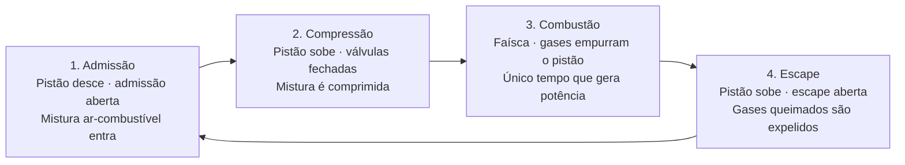

# Teoria do Motor — O Ciclo de 4 Tempos

&emsp;Antes de programar qualquer linha de código da ECU, é preciso entender o que o motor faz e em que momento ele precisa de cada decisão da unidade de controle. Quase todo motor a gasolina de automóvel funciona segundo o **ciclo de quatro tempos**, também chamado de ciclo Otto, patenteado por Nikolaus Otto no século XIX. Este documento resume os quatro tempos com nossas próprias palavras e descreve o papel da ECU em cada um deles, servindo de base teórica para todo o restante do projeto.

## Conceitos básicos

&emsp;Dentro de cada cilindro há um **pistão** que sobe e desce. Ele está ligado por uma biela ao **virabrequim**, que converte o movimento de vai-e-vem do pistão em rotação. O ponto mais alto que o pistão alcança é o **Ponto Morto Superior (PMS)** e o mais baixo é o **Ponto Morto Inferior (PMI)**. A entrada e a saída de gases são controladas por duas válvulas: a **válvula de admissão** e a **válvula de escape**. A ignição da mistura é feita pela **vela**, e o combustível é introduzido pelo **injetor**.

&emsp;Cada "tempo" corresponde a um curso completo do pistão entre o PMS e o PMI, ou seja, a meia volta do virabrequim. Como são quatro tempos, **um ciclo completo equivale a duas voltas do virabrequim (720°)**. Um detalhe importante para o controle: dos quatro tempos, **apenas um gera potência** — os outros três são preparados pela inércia do motor e pelos demais cilindros.

## Os quatro tempos

### 1. Admissão

&emsp;O pistão desce do PMS em direção ao PMI com a **válvula de admissão aberta** e a de escape fechada. Esse movimento cria uma depressão no cilindro que "suga" para dentro a mistura de ar e combustível. É nesse tempo que se define quanto ar — e, por consequência, quanto combustível — entrará no cilindro. O virabrequim percorre de 0° a 180°.

### 2. Compressão

&emsp;Com **as duas válvulas fechadas**, o pistão sobe do PMI ao PMS e comprime a mistura num volume muito menor. A compressão aproxima as moléculas e aumenta a temperatura e a pressão, deixando a mistura pronta para queimar de forma rápida e eficiente. Ainda **antes** de o pistão atingir o PMS, a vela é acionada — esse adiantamento é o **avanço de ignição**. O virabrequim percorre de 180° a 360°.

### 3. Combustão (Expansão / Potência)

&emsp;A faísca incendeia a mistura comprimida. A queima gera gases em alta pressão que **empurram o pistão de volta do PMS ao PMI**, e é justamente esse empurrão que transfere energia ao virabrequim. Por isso este é o **único tempo que produz trabalho útil**; os demais consomem energia. O avanço de ignição existe para que o pico de pressão da queima ocorra logo após o PMS, extraindo o máximo de torque. O virabrequim percorre de 360° a 540°.

### 4. Escape

&emsp;Com a **válvula de escape aberta**, o pistão sobe novamente e expulsa os gases queimados do cilindro para o sistema de escapamento. Ao chegar ao PMS, o cilindro está vazio e pronto para reiniciar o ciclo na admissão. O virabrequim percorre de 540° a 720°, completando as duas voltas.

<small><strong style={{fontSize: '12px'}}>Quadro 1: Resumo dos quatro tempos do motor</strong></small>

| Tempo | Movimento do pistão | Válvulas | Ângulo do virabrequim | O que acontece |
|-------|--------------------|----------|-----------------------|----------------|
| 1. Admissão | PMS → PMI (desce) | Admissão aberta | 0° – 180° | Entrada da mistura ar-combustível |
| 2. Compressão | PMI → PMS (sobe) | Ambas fechadas | 180° – 360° | Mistura comprimida; faísca antes do PMS |
| 3. Combustão | PMS → PMI (desce) | Ambas fechadas | 360° – 540° | Queima empurra o pistão — gera potência |
| 4. Escape | PMI → PMS (sobe) | Escape aberta | 540° – 720° | Expulsão dos gases queimados |

<small style={{marginTop: '4px', fontSize: '10px'}}>Fonte: Material produzido pelo grupo, 2026.</small>

## O papel da ECU em cada tempo

&emsp;A ECU não trabalha em quatro etapas isoladas: ela executa um **laço de controle contínuo, disparado pela posição do virabrequim**. O sensor de posição do virabrequim (CKP) informa a cada instante onde o motor está no ciclo e qual é a rotação (RPM), enquanto um sensor de fase (no eixo de comando) permite distinguir em qual das duas voltas o cilindro se encontra. Com essas referências, a ECU **agenda** dois eventos no ângulo correto: a abertura do injetor e a faísca. As tarefas abaixo descrevem o que a ECU calcula e comanda em relação a cada tempo.

### Na admissão — calcular e injetar o combustível

&emsp;Este é o momento em que a ECU decide a **quantidade de combustível**. Ela estima a massa de ar que está entrando no cilindro a partir da pressão do coletor (MAP), da rotação (RPM), da posição da borboleta (TPS) e da temperatura do ar (IAT). Com essa estimativa de carga, calcula o **tempo de abertura do injetor** necessário para atingir a mistura ar-combustível desejada — próxima da relação estequiométrica de cerca de 14,7:1 para gasolina. Sobre esse valor base, aplica correções: enriquecimento de partida a frio em função da temperatura do líquido (CLT), correção pela densidade do ar (IAT) e enriquecimento de aceleração quando a borboleta abre rapidamente (TPS).

### Na compressão — preparar a ignição

&emsp;Com as válvulas fechadas, a ECU prepara a faísca. Ela consulta o **mapa de ignição** para obter o avanço adequado àquela combinação de rotação e carga, e carrega a bobina pelo tempo necessário (o *dwell*) para que a centelha tenha energia suficiente. O objetivo é disparar a vela no instante exato, alguns graus **antes do PMS**, de modo que a pressão máxima da combustão ocorra logo após o PMS.

### Na combustão — disparar a faísca no instante certo

&emsp;A ECU comanda a faísca no ângulo calculado. A precisão aqui é crítica: faísca cedo demais provoca **detonação** (batida de pino), que danifica o motor; faísca tarde demais desperdiça energia e reduz o torque. Em ECUs equipadas com sensor de detonação, o avanço é recuado automaticamente ao detectar batida; na V1 deste projeto, essa proteção é feita por **mapas de ignição conservadores**, conforme descrito na [Arquitetura](/arquitetura).

### No escape — medir o resultado e corrigir

&emsp;Quando os gases queimados passam pelo escapamento, a **sonda lambda** mede o teor de oxigênio remanescente, revelando se a mistura queimada estava rica ou pobre. A ECU usa essa leitura como **realimentação de malha fechada**: ajusta o fator de correção de combustível para os próximos ciclos, mantendo a mistura próxima do alvo. Esse controle melhora o consumo, reduz emissões e preserva o funcionamento do catalisador.

<small><strong style={{fontSize: '12px'}}>Quadro 2: Ação da ECU em cada tempo do motor</strong></small>

| Tempo | Sensores principais lidos | Decisão / comando da ECU |
|-------|---------------------------|--------------------------|
| 1. Admissão | MAP, RPM (CKP), TPS, IAT | Calcula a carga de ar e comanda o tempo de injeção (mistura ar-combustível) |
| 2. Compressão | RPM (CKP), carga, CLT | Consulta o mapa de ignição, define o avanço e carrega a bobina (*dwell*) |
| 3. Combustão | RPM (CKP), (detonação) | Dispara a faísca no ângulo exato para máximo torque sem detonação |
| 4. Escape | Sonda lambda (O₂) | Mede a mistura queimada e corrige o combustível em malha fechada |

<small style={{marginTop: '4px', fontSize: '10px'}}>Fonte: Material produzido pelo grupo, 2026.</small>

## Por que isso importa para o projeto

&emsp;Em um motor de 4 cilindros, os tempos são defasados de 180° entre si, de forma que sempre há um cilindro em combustão a cada meia volta do virabrequim — o que mantém o giro suave. A ECU gerencia a injeção e a ignição de cada cilindro de forma independente, na ordem de queima (comumente 1-3-4-2). Entender esse encadeamento é a base para os dois mapas centrais do projeto, o de combustível e o de ignição, e para a estratégia de leitura em duas fases (OBD-II e sensores diretos) detalhada na página de [Arquitetura](/arquitetura). Na **Fase 1**, a ECU apenas *lê* essas grandezas de um motor real; na **Fase 2**, passa de fato a *comandar* injeção e ignição em cada tempo.

## Referências

- HowStuffWorks. *What is the four-stroke combustion cycle?* Disponível em: [https://auto.howstuffworks.com/four-stroke-combustion-cycle.htm](https://auto.howstuffworks.com/four-stroke-combustion-cycle.htm). Acesso em: 9 jun. 2026.
- HowStuffWorks. *How Car Engines Work.* Disponível em: [https://auto.howstuffworks.com/engine.htm](https://auto.howstuffworks.com/engine.htm). Acesso em: 9 jun. 2026.
- FENSKE, Jason. *Engineering Explained* (canal de referência no YouTube). Disponível em: [https://www.youtube.com/@EngineeringExplained](https://www.youtube.com/@EngineeringExplained). Acesso em: 9 jun. 2026.
- WIKIPEDIA. *Four-stroke engine.* Disponível em: [https://en.wikipedia.org/wiki/Four-stroke_engine](https://en.wikipedia.org/wiki/Four-stroke_engine). Acesso em: 9 jun. 2026.
- HEYWOOD, John B. *Internal Combustion Engine Fundamentals.* 2. ed. New York: McGraw-Hill, 2018.
- BOSCH. *Automotive Handbook.* 10. ed. Robert Bosch GmbH, 2018.

