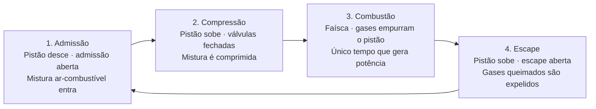

# Teoria do Motor a combustão

<div style={{textAlign: 'justify'}}>

&emsp;Antes de programar qualquer linha de código da ECU, é preciso entender o que o motor faz e em que momento ele precisa de cada decisão da unidade de controle. Esta página reúne a base teórica do projeto: o **ciclo de quatro tempos** e o papel da ECU em cada um deles, a **mistura ar-combustível e o conceito de lambda**, os **sensores** que a ECU precisa ler, o funcionamento dos **injetores**, a estrutura do **mapa de combustível** com interpolação e as **correções de injeção** aplicadas sobre o mapa base.

&emsp;Quase todo motor a gasolina de automóvel funciona segundo o ciclo de quatro tempos, também chamado de ciclo Otto, patenteado por Nikolaus Otto no século XIX. Começamos por ele, porque é o ciclo que define os momentos em que todas as demais decisões acontecem.

## Conceitos básicos

&emsp;Dentro de cada cilindro há um **pistão** que sobe e desce. Ele está ligado por uma biela ao **virabrequim**, que converte o movimento de vai-e-vem do pistão em rotação. O ponto mais alto que o pistão alcança é o **Ponto Morto Superior (PMS)** e o mais baixo é o **Ponto Morto Inferior (PMI)**. A entrada e a saída de gases são controladas por duas válvulas: a **válvula de admissão** e a **válvula de escape**. A ignição da mistura é feita pela **vela**, e o combustível é introduzido pelo **injetor**.

&emsp;Cada "tempo" corresponde a um curso completo do pistão entre o PMS e o PMI, ou seja, a meia volta do virabrequim. Como são quatro tempos, **um ciclo completo equivale a duas voltas do virabrequim (720°)**. Um detalhe importante para o controle: dos quatro tempos, **apenas um gera potência** — os outros três são preparados pela inércia do motor e pelos demais cilindros.



## Os quatro tempos

### 1. Admissão

&emsp;O pistão desce do PMS em direção ao PMI com a **válvula de admissão aberta** e a de escape fechada. Esse movimento cria uma depressão no cilindro que "suga" para dentro a mistura de ar e combustível. É nesse tempo que se define quanto ar — e, por consequência, quanto combustível — entrará no cilindro. O virabrequim percorre de 0° a 180°.

### 2. Compressão

&emsp;Com **as duas válvulas fechadas**, o pistão sobe do PMI ao PMS e comprime a mistura num volume muito menor. A compressão aproxima as moléculas e aumenta a temperatura e a pressão, deixando a mistura pronta para queimar de forma rápida e eficiente. Ainda **antes** de o pistão atingir o PMS, a vela é acionada — esse adiantamento é o **avanço de ignição**. O virabrequim percorre de 180° a 360°.

### 3. Combustão (Expansão / Potência)

&emsp;A faísca incendeia a mistura comprimida. A queima gera gases em alta pressão que **empurram o pistão de volta do PMS ao PMI**, e é justamente esse empurrão que transfere energia ao virabrequim. Por isso este é o **único tempo que produz trabalho útil**; os demais consomem energia. O avanço de ignição existe para que o pico de pressão da queima ocorra logo após o PMS, extraindo o máximo de torque. O virabrequim percorre de 360° a 540°.

### 4. Escape

&emsp;Com a **válvula de escape aberta**, o pistão sobe novamente e expulsa os gases queimados do cilindro para o sistema de escapamento. Ao chegar ao PMS, o cilindro está vazio e pronto para reiniciar o ciclo na admissão. O virabrequim percorre de 540° a 720°, completando as duas voltas.

<div align="center">
<small><strong style={{fontSize: '12px'}}>Quadro 1: Resumo dos quatro tempos do motor</strong></small>

| Tempo         | Movimento do pistão | Válvulas        | Ângulo do virabrequim | O que acontece                          |
| ------------- | ------------------- | --------------- | --------------------- | --------------------------------------- |
| 1. Admissão   | PMS → PMI (desce)   | Admissão aberta | 0° – 180°             | Entrada da mistura ar-combustível       |
| 2. Compressão | PMI → PMS (sobe)    | Ambas fechadas  | 180° – 360°           | Mistura comprimida; faísca antes do PMS |
| 3. Combustão  | PMS → PMI (desce)   | Ambas fechadas  | 360° – 540°           | Queima empurra o pistão — gera potência |
| 4. Escape     | PMI → PMS (sobe)    | Escape aberta   | 540° – 720°           | Expulsão dos gases queimados            |

<small style={{marginTop: '4px', fontSize: '10px'}}>Fonte: Material produzido pelo grupo, 2026.</small>

</div>

## O papel da ECU em cada tempo

&emsp;A ECU não trabalha em quatro etapas isoladas: ela executa um **laço de controle contínuo, disparado pela posição do virabrequim**. O sensor de posição do virabrequim (CKP) informa a cada instante onde o motor está no ciclo e qual é a rotação (RPM), enquanto um sensor de fase (no eixo de comando) permite distinguir em qual das duas voltas o cilindro se encontra. Com essas referências, a ECU **agenda** dois eventos no ângulo correto: a abertura do injetor e a faísca. As tarefas abaixo descrevem o que a ECU calcula e comanda em relação a cada tempo.

### Na admissão — calcular e injetar o combustível

&emsp;Este é o momento em que a ECU decide a **quantidade de combustível**. Ela estima a massa de ar que está entrando no cilindro a partir da pressão do coletor (MAP), da rotação (RPM), da posição da borboleta (TPS) e da temperatura do ar (IAT). Com essa estimativa de carga, calcula o **tempo de abertura do injetor** necessário para atingir a mistura ar-combustível desejada — próxima da relação estequiométrica de cerca de 14,7:1 para gasolina. Sobre esse valor base, aplica correções: enriquecimento de partida a frio em função da temperatura do líquido (CLT), correção pela densidade do ar (IAT) e enriquecimento de aceleração quando a borboleta abre rapidamente (TPS).

### Na compressão — preparar a ignição

&emsp;Com as válvulas fechadas, a ECU prepara a faísca. Ela consulta o **mapa de ignição** para obter o avanço adequado àquela combinação de rotação e carga, e carrega a bobina pelo tempo necessário (o _dwell_) para que a centelha tenha energia suficiente. O objetivo é disparar a vela no instante exato, alguns graus **antes do PMS**, de modo que a pressão máxima da combustão ocorra logo após o PMS.

### Na combustão — disparar a faísca no instante certo

&emsp;A ECU comanda a faísca no ângulo calculado. A precisão aqui é crítica: faísca cedo demais provoca **detonação** (batida de pino), que danifica o motor; faísca tarde demais desperdiça energia e reduz o torque. Em ECUs equipadas com sensor de detonação, o avanço é recuado automaticamente ao detectar batida; na V1 deste projeto, essa proteção é feita por **mapas de ignição conservadores**, conforme descrito na [Arquitetura](/arquitetura).

### No escape — medir o resultado e corrigir

&emsp;Quando os gases queimados passam pelo escapamento, a **sonda lambda** mede o teor de oxigênio remanescente, revelando se a mistura queimada estava rica ou pobre. A ECU usa essa leitura como **realimentação de malha fechada**: ajusta o fator de correção de combustível para os próximos ciclos, mantendo a mistura próxima do alvo. Esse controle melhora o consumo, reduz emissões e preserva o funcionamento do catalisador.

<div align="center">
<small><strong style={{fontSize: '12px'}}>Quadro 2: Ação da ECU em cada tempo do motor</strong></small>

| Tempo         | Sensores principais lidos | Decisão / comando da ECU                                                    |
| ------------- | ------------------------- | --------------------------------------------------------------------------- |
| 1. Admissão   | MAP, RPM (CKP), TPS, IAT  | Calcula a carga de ar e comanda o tempo de injeção (mistura ar-combustível) |
| 2. Compressão | RPM (CKP), carga, CLT     | Consulta o mapa de ignição, define o avanço e carrega a bobina (_dwell_)    |
| 3. Combustão  | RPM (CKP), (detonação)    | Dispara a faísca no ângulo exato para máximo torque sem detonação           |
| 4. Escape     | Sonda lambda (O₂)         | Mede a mistura queimada e corrige o combustível em malha fechada            |

<small style={{marginTop: '4px', fontSize: '10px'}}>Fonte: Material produzido pelo grupo, 2026.</small>

</div>

## Mistura ar-combustível e lambda

&emsp;Para o motor funcionar bem, o ar e o combustível precisam entrar no cilindro em uma proporção correta. Essa proporção é descrita de duas formas equivalentes: a **relação ar-combustível (AFR, do inglês _Air-Fuel Ratio_)** e o **lambda (λ)**.

&emsp;A AFR é a razão entre a massa de ar e a massa de combustível admitidas. Existe uma proporção em que todo o combustível queima de forma completa, sem sobra de ar nem de combustível, chamada **mistura estequiométrica**. Para a gasolina, essa proporção é de aproximadamente **14,7:1** — cerca de 14,7 partes de ar para cada parte de combustível, em massa.

&emsp;O lambda nada mais é do que a AFR medida dividida pela AFR estequiométrica daquele combustível:

```
λ = AFR medida ÷ AFR estequiométrica
```

&emsp;A partir dessa definição: **λ = 1** indica mistura estequiométrica (o ponto exato de queima completa); **λ < 1** indica mistura **rica** (excesso de combustível, falta de ar); e **λ > 1** indica mistura **pobre** (excesso de ar, falta de combustível).

&emsp;A grande vantagem do lambda é ser **independente do combustível**. Como a AFR estequiométrica muda de um combustível para outro (a gasolina fica perto de 14,7:1, enquanto o etanol fica perto de 9:1), dizer "14,0:1" só faz sentido sabendo qual é o combustível; já λ = 0,95 significa "5% mais rico que o estequiométrico" para qualquer combustível. Para converter um no outro, basta multiplicar: para gasolina, **AFR = λ × 14,7**. Por exemplo, λ = 0,85 equivale a 12,5:1 (rica) e λ = 1,05 equivale a 15,4:1 (pobre).

### O que acontece quando a mistura está rica ou pobre

&emsp;**Mistura rica (λ < 1).** Há mais combustível do que o ar consegue queimar. O excesso de combustível resfria a câmara de combustão e ajuda a proteger o motor contra detonação e superaquecimento — é por isso que a ECU enriquece a mistura em **plena carga**, onde a potência máxima costuma ocorrer ligeiramente rica, em torno de λ 0,85–0,90. O custo é maior consumo, mais emissões de monóxido de carbono e de hidrocarbonetos não queimados e, em excesso, fuligem, velas encharcadas e diluição do óleo.

&emsp;**Mistura pobre (λ > 1).** Há ar em excesso. A queima é mais econômica e, até certo ponto, mais limpa — a melhor economia fica em torno de λ 1,05–1,10. O problema é que misturas pobres queimam **mais quente** e aumentam o risco de **detonação (batida de pino)**, que pode danificar pistões e válvulas. Pobre demais, a mistura sequer inflama de forma estável (falha de combustão por mistura pobre): o motor perde potência e pode superaquecer.

&emsp;**Estequiométrica (λ = 1).** É o alvo na maior parte da operação em carga parcial, porque garante queima completa, bom equilíbrio entre consumo e potência e, principalmente, é a condição em que o **catalisador de três vias** trabalha com máxima eficiência no tratamento dos gases.

&emsp;O papel da ECU é justamente **acertar o lambda alvo** dosando o combustível: ela calcula quanto injetar para atingir a mistura desejada em cada condição e usa a leitura da sonda lambda no escape como realimentação para corrigir desvios (o controle de malha fechada descrito na seção anterior).

<div align="center">
<small><strong style={{fontSize: '12px'}}>Quadro 3: Faixas de lambda e seus efeitos</strong></small>

| Condição        | Lambda (λ)         | AFR (gasolina)          | Efeito principal                                          |
| --------------- | ------------------ | ----------------------- | --------------------------------------------------------- |
| Rica            | &lt; 1 (ex.: 0,85) | &lt; 14,7 (ex.: 12,5:1) | Mais potência e proteção térmica; mais consumo e emissões |
| Estequiométrica | = 1                | 14,7:1                  | Queima completa; condição ideal para o catalisador        |
| Pobre           | &gt; 1 (ex.: 1,05) | &gt; 14,7 (ex.: 15,4:1) | Mais economia; risco de detonação e superaquecimento      |

<small style={{marginTop: '4px', fontSize: '10px'}}>Fonte: Material produzido pelo grupo, 2026.</small>

</div>

## Os sensores que a ECU lê

&emsp;A ECU só consegue calcular injeção e ignição porque "enxerga" o estado do motor através de sensores. Cada sensor converte uma grandeza física (rotação, pressão, temperatura, posição) em um **sinal elétrico** que o microcontrolador — o pequeno computador (chip) que executa a ECU — consegue ler. Esses sinais se dividem em dois tipos: **digitais** (pulsos que alternam entre dois níveis de tensão; cada transição entre os níveis, a subida ou a descida do pulso, é chamada de _borda_, e é nela que a ECU detecta o pulso — seja por _interrupção_, quando o processador reage no instante exato de cada pulso, seja por _temporizador_, que mede o tempo entre pulsos) e **analógicos** (uma tensão contínua proporcional à grandeza, lida pelo conversor analógico-digital, o ADC). Os cinco sensores principais de entrada são descritos a seguir.

&emsp;**CKP — posição do virabrequim.** É o sensor mais importante para o sincronismo. Ele lê os dentes de uma roda fônica presa ao virabrequim (tipicamente uma roda "36−1", com um dente faltando que serve de referência de posição). A partir desses pulsos, a ECU calcula a **rotação (RPM)** e sabe em que ângulo o motor está, para agendar injeção e faísca. Produz um **sinal digital** de pulsos. Há duas tecnologias comuns: o sensor de **relutância variável** (indutivo — funciona como um pequeno gerador, em que cada dente que passa induz a tensão), que gera uma onda de tensão alternada cuja frequência e amplitude crescem com a rotação; e o sensor de **efeito Hall** (eletrônico, alimentado por tensão), que entrega uma onda quadrada limpa entre 0 e 5 V.

&emsp;**MAP — pressão absoluta do coletor de admissão.** Mede a pressão do ar no coletor, principal indicador de **carga** do motor (quanto ar está entrando). Produz um **sinal analógico**: uma tensão proporcional à pressão (por exemplo, de ~0,5 V em vácuo alto a ~4,5 V próximo da pressão atmosférica), gerada por um elemento piezorresistivo (um material cuja resistência elétrica muda conforme a pressão aplicada).

&emsp;**TPS — posição da borboleta.** Indica o quanto o acelerador está aberto, em porcentagem, revelando a **demanda do condutor**. É um **potenciômetro** (resistor variável) e produz um **sinal analógico**, uma tensão que cresce com a abertura (tipicamente ~0,5 V fechado a ~4,5 V em plena abertura). Sua taxa de variação é usada no enriquecimento de aceleração.

&emsp;**CLT — temperatura do líquido de arrefecimento.** Informa se o motor está frio ou já aquecido, base para a correção de partida a frio. É um **termistor NTC** (_Negative Temperature Coefficient_): sua resistência **diminui** conforme a temperatura sobe. Ligado em um divisor de tensão (um arranjo de dois resistores que transforma a variação de resistência do sensor em uma variação de tensão que a ECU consegue medir), produz um **sinal analógico** não linear, que a ECU converte em °C por uma tabela.

&emsp;**IAT — temperatura do ar admitido.** Mede a temperatura do ar que entra, necessária para corrigir a **densidade** do ar no cálculo da massa (ar quente é menos denso e contém menos oxigênio). Funciona como o CLT: é um **termistor NTC** lido como **sinal analógico** por divisor de tensão.

<div align="center">
<small><strong style={{fontSize: '12px'}}>Quadro 4: Sensores de entrada da ECU e seus sinais elétricos</strong></small>

| Sensor              | Grandeza medida             | Tipo de sinal elétrico                    | Como a ECU lê                      |
| ------------------- | --------------------------- | ----------------------------------------- | ---------------------------------- |
| CKP (virabrequim)   | Posição e rotação (RPM)     | Digital (trem de pulsos)                  | Interrupção/temporizador por borda |
| MAP (coletor)       | Pressão de admissão (carga) | Analógico (tensão proporcional à pressão) | ADC                                |
| TPS (borboleta)     | Abertura da borboleta (%)   | Analógico (potenciômetro)                 | ADC                                |
| CLT (arrefecimento) | Temperatura do motor        | Analógico (termistor NTC)                 | ADC + tabela de conversão          |
| IAT (ar admitido)   | Temperatura do ar           | Analógico (termistor NTC)                 | ADC + tabela de conversão          |

<small style={{marginTop: '4px', fontSize: '10px'}}>Fonte: Material produzido pelo grupo, 2026.</small>

</div>

&emsp;A correspondência desses sensores com os dados disponíveis via OBD-II na Fase 1 está detalhada na página de [Arquitetura](/arquitetura).

## Os injetores de combustível

&emsp;O injetor é uma **válvula elétrica** acionada por uma **bobina interna** (por isso é chamado de _solenoide_): quando a ECU energiza essa bobina do injetor, a válvula abre e o combustível pressurizado é pulverizado; quando a ECU corta a energia, a válvula fecha. Como o combustível chega ao injetor sob pressão constante e regulada, a **quantidade injetada depende basicamente de quanto tempo o injetor fica aberto**.

### Tempo de injeção (pulse width)

&emsp;O **tempo de injeção**, ou _pulse width_, é a duração (em milissegundos) em que a ECU mantém o injetor aberto a cada ciclo. Quanto maior esse tempo, mais combustível entra. Ele **varia o tempo todo** porque a quantidade de combustível necessária muda conforme a condição: em marcha lenta, com pouco ar entrando, o tempo é curto (poucos ms); em plena carga e alta rotação, com muito ar, o tempo é bem maior. A ECU calcula esse tempo a partir da estimativa de ar (carga), do lambda alvo e das correções — ou seja, o tempo de injeção é a "saída" de todo o cálculo de combustível.

### Alta vs baixa impedância

&emsp;A _impedância_ de um injetor é, na prática, a **resistência elétrica** da sua bobina — a oposição que ela oferece à passagem de corrente, medida em _ohms_, cujo símbolo é a letra grega ômega (Ω). Conforme essa resistência, os injetores se dividem em dois tipos; quanto menor ela for, maior a corrente (medida em ampères, A) que circula ao energizar o injetor, e isso muda **como a ECU precisa acioná-los**:

- **Alta impedância (saturados, ~12–16 Ω):** podem ser acionados de forma simples, aplicando a tensão da bateria diretamente — a própria resistência limita a corrente a um valor seguro (cerca de 1 A). Exigem um driver mais simples e são os mais comuns em veículos de fábrica.
- **Baixa impedância (_peak-and-hold_, ~2–5 Ω):** deixam passar muito mais corrente, então precisam de um driver que aplique um **pico** de corrente alta para abrir rápido e depois reduza para uma corrente de **manutenção** menor, suficiente para mantê-los abertos sem superaquecer. Sem esse controle de corrente, a bobina esquentaria e poderia queimar. São usados em injetores de alta vazão.

### Dead time (tempo morto)

&emsp;Um injetor não abre no exato instante em que é energizado: existe um pequeno atraso mecânico e elétrico até ele abrir de fato (e também leva um tempo para fechar). Esse atraso é o **dead time**, ou tempo morto do injetor — durante ele, a ECU já mandou o comando, mas quase nenhum combustível fluiu ainda.

&emsp;O dead time depende fortemente da **tensão da bateria**: com tensão mais baixa, o solenoide abre mais devagar e o tempo morto aumenta. Por isso a ECU **precisa compensar**: ela soma o dead time ao tempo de injeção calculado, usando uma tabela de tempo morto em função da tensão. Sem essa compensação, o erro seria pequeno em plena carga (onde o tempo de injeção é longo), mas enorme em marcha lenta (onde o tempo é curto e o dead time representa uma fração grande do total) — e o motor ficaria pobre e instável sempre que a tensão variasse. De forma simplificada:

```
tempo comandado = tempo de injeção calculado + dead time(tensão da bateria)
```

<div align="center">
<small><strong style={{fontSize: '12px'}}>Quadro 5: Comparação entre injetores de alta e baixa impedância</strong></small>

| Característica        | Alta impedância (saturado)                  | Baixa impedância (peak-and-hold)            |
| --------------------- | ------------------------------------------- | ------------------------------------------- |
| Resistência da bobina | ~12–16 Ω                                    | ~2–5 Ω                                      |
| Corrente              | Baixa, limitada pela resistência (~1 A)     | Alta; exige controle de pico e manutenção   |
| Driver necessário     | Simples (saturado)                          | Complexo (peak-and-hold)                    |
| Uso típico            | Vazões baixas e médias; veículos de fábrica | Vazões altas; aplicações de alto desempenho |

<small style={{marginTop: '4px', fontSize: '10px'}}>Fonte: Material produzido pelo grupo, 2026.</small>

</div>

## O mapa de combustível e a interpolação

&emsp;A quantidade base de combustível não vem de uma fórmula fechada: ela vem de uma **tabela bidimensional** chamada **mapa de combustível**. As duas entradas (os eixos) são a **rotação (RPM)** e a **carga** do motor (normalmente a pressão do coletor, MAP, medida em quilopascals, kPa — uma unidade de pressão; como referência, a pressão atmosférica ao nível do mar é de cerca de 100 kPa). Cada célula da tabela guarda o valor base de combustível para aquela combinação específica de rotação e carga. A ECU descobre em que rotação e carga o motor está, localiza a célula correspondente e lê o valor.

&emsp;Usa-se uma tabela, e não uma equação, porque o comportamento real de um motor é complexo e não linear: a melhor dosagem para cada ponto é descoberta empiricamente, durante a calibração, e gravada na grade. O exemplo abaixo mostra um mapa 4×4 simplificado, com o tempo de injeção (em ms) para quatro rotações e quatro níveis de carga:

<div align="center">
<small><strong style={{fontSize: '12px'}}>Quadro 6: Exemplo de mapa de combustível 4×4 (tempo de injeção em ms)</strong></small>

|              | MAP 30 kPa | MAP 50 kPa | MAP 70 kPa | MAP 90 kPa |
| ------------ | ---------- | ---------- | ---------- | ---------- |
| **1000 RPM** | 2,0        | 3,0        | 4,0        | 5,0        |
| **2000 RPM** | 2,4        | 3,6        | 4,8        | 6,0        |
| **3000 RPM** | 2,8        | 4,2        | 5,6        | 7,0        |
| **4000 RPM** | 3,2        | 4,8        | 6,4        | 8,0        |

<small style={{marginTop: '4px', fontSize: '10px'}}>Fonte: Material produzido pelo grupo, 2026.</small>

</div>

### Interpolação: encontrar o valor entre as células

&emsp;O motor quase nunca opera exatamente sobre um ponto da grade — ele cai **entre** as células. Se a ECU simplesmente usasse a célula mais próxima, o combustível daria "saltos" bruscos a cada mudança de faixa. Para evitar isso, ela calcula um valor intermediário por **interpolação**, garantindo uma transição suave e contínua.

&emsp;Em uma dimensão, interpolar é achar o valor proporcional entre dois pontos. Como o mapa tem **dois** eixos, usa-se a **interpolação bilinear**: interpola-se primeiro ao longo de um eixo e depois ao longo do outro.

&emsp;Vamos a um exemplo concreto com o mapa acima, para o ponto **2500 RPM e 60 kPa**. Esse ponto cai entre quatro células: (2000 RPM, 50 kPa) = 3,6; (3000 RPM, 50 kPa) = 4,2; (2000 RPM, 70 kPa) = 4,8; (3000 RPM, 70 kPa) = 5,6.

```
Passo 1 — interpolar pela rotação (2500 está no meio entre 2000 e 3000):
  em 50 kPa: 3,6 + 0,5 × (4,2 − 3,6) = 3,9
  em 70 kPa: 4,8 + 0,5 × (5,6 − 4,8) = 5,2

Passo 2 — interpolar pela carga (60 kPa está no meio entre 50 e 70):
  3,9 + 0,5 × (5,2 − 3,9) = 4,55 ms
```

&emsp;O resultado, **4,55 ms**, é o tempo de injeção base para aquela condição — um valor que não está escrito em nenhuma célula, mas que a ECU obtém combinando as quatro vizinhas. A mesma lógica vale para o mapa de ignição. A estrutura geral dos mapas e o uso da interpolação no núcleo de controle estão descritos na página de [Arquitetura](/arquitetura).

## Correções de injeção

&emsp;O valor lido no mapa de combustível é apenas o **ponto de partida**. Sobre ele, a ECU aplica **correções** que ajustam a quantidade de combustível para situações que o mapa base, sozinho, não cobre. Três correções são fundamentais.

&emsp;**Partida a frio e aquecimento (enriquecimento de aquecimento).** Com o motor frio, parte do combustível se condensa nas paredes frias do coletor e se vaporiza mal, então menos combustível chega de fato vaporizado ao cilindro; além disso, uma mistura mais rica ajuda a manter a queima estável enquanto o motor está frio. Por isso a ECU **adiciona combustível** quando o motor está frio, em uma quantidade que depende da temperatura do líquido (CLT) e que vai **diminuindo** conforme o motor aquece, até zerar (100% = sem correção) na temperatura de operação. Logo após a partida, há ainda um enriquecimento extra por alguns segundos para estabilizar a marcha lenta.

&emsp;**Enriquecimento de aceleração.** Quando o condutor pisa fundo de repente, o ar preenche o coletor quase instantaneamente, mas o combustível "atrasa" — parte dele forma um filme nas paredes do coletor e demora a chegar ao cilindro. Sem correção, a mistura fica momentaneamente **pobre**, causando uma hesitação ou "engasgo". Para compensar, a ECU detecta a abertura rápida da borboleta (pela taxa de variação do TPS) e injeta um **acréscimo transitório** de combustível durante um curto intervalo — o equivalente eletrônico da "bomba de aceleração" dos carburadores. **É por isso que o enriquecimento de aceleração é necessário:** ele cobre o atraso do combustível em relação ao ar nos transientes, evitando a falha por mistura pobre.

&emsp;**Corte de combustível (desaceleração e limitador de rotação).** Em duas situações a ECU faz o oposto — **corta** o combustível:

- **Corte na desaceleração (_cut-off_):** quando o condutor tira o pé com o motor em rotação alta e a borboleta fechada, o carro está "empurrando" o motor pelas rodas e não há necessidade de combustível. A ECU **corta a injeção**, economizando combustível e reduzindo emissões, e a religa antes de a rotação cair para a marcha lenta.
- **Limitador de rotação (_rev limiter_):** para proteger o motor de girar além do limite seguro, a ECU corta o combustível (e/ou a faísca) ao atingir a rotação máxima, impedindo danos mecânicos.

<div align="center">
<small><strong style={{fontSize: '12px'}}>Quadro 7: Correções de injeção aplicadas sobre o mapa base</strong></small>

| Correção                     | Quando ocorre (gatilho)                              | O que a ECU faz                                            | Por quê                                                    |
| ---------------------------- | ---------------------------------------------------- | ---------------------------------------------------------- | ---------------------------------------------------------- |
| Aquecimento / partida a frio | Motor frio (CLT baixa)                               | Adiciona combustível, decrescente até a temperatura normal | Combustível condensa e vaporiza mal a frio                 |
| Enriquecimento de aceleração | Abertura rápida da borboleta (TPS subindo)           | Injeta um pulso extra transitório de combustível           | O combustível atrasa em relação ao ar; evita mistura pobre |
| Corte na desaceleração       | Pé fora do acelerador + RPM alta + borboleta fechada | Corta a injeção temporariamente                            | Não há demanda de potência; economiza e reduz emissões     |
| Limitador de rotação         | RPM atinge o limite máximo                           | Corta combustível e/ou faísca                              | Protege o motor contra excesso de rotação                  |

<small style={{marginTop: '4px', fontSize: '10px'}}>Fonte: Material produzido pelo grupo, 2026.</small>

</div>

## Por que isso importa para o projeto

&emsp;Em um motor de 4 cilindros, os tempos são defasados de 180° entre si, de forma que sempre há um cilindro em combustão a cada meia volta do virabrequim — o que mantém o giro suave. A ECU gerencia a injeção e a ignição de cada cilindro de forma independente, na ordem de queima (comumente 1-3-4-2). Entender esse encadeamento é a base para os dois mapas centrais do projeto, o de combustível e o de ignição, e para a estratégia de leitura em duas fases (OBD-II e sensores diretos) detalhada na página de [Arquitetura](/arquitetura). Na **Fase 1**, a ECU apenas _lê_ essas grandezas de um motor real; na **Fase 2**, passa de fato a _comandar_ injeção e ignição em cada tempo.

## Referências

- HowStuffWorks. _What is the four-stroke combustion cycle?_ Disponível em: [https://auto.howstuffworks.com/four-stroke-combustion-cycle.htm](https://auto.howstuffworks.com/four-stroke-combustion-cycle.htm). Acesso em: 9 jun. 2026.
- HowStuffWorks. _How Car Engines Work._ Disponível em: [https://auto.howstuffworks.com/engine.htm](https://auto.howstuffworks.com/engine.htm). Acesso em: 9 jun. 2026.
- FENSKE, Jason. _Engineering Explained_ (canal de referência no YouTube). Disponível em: [https://www.youtube.com/@EngineeringExplained](https://www.youtube.com/@EngineeringExplained). Acesso em: 9 jun. 2026.
- WIKIPEDIA. _Four-stroke engine._ Disponível em: [https://en.wikipedia.org/wiki/Four-stroke_engine](https://en.wikipedia.org/wiki/Four-stroke_engine). Acesso em: 9 jun. 2026.
- HEYWOOD, John B. _Internal Combustion Engine Fundamentals._ 2. ed. New York: McGraw-Hill, 2018.
- BOSCH. _Automotive Handbook._ 10. ed. Robert Bosch GmbH, 2018.
- SUMMIT RACING. _Engine Basics — Air/Fuel Mixture._ Disponível em: [https://help.summitracing.com/knowledgebase/article/SR-05230/en-us](https://help.summitracing.com/knowledgebase/article/SR-05230/en-us). Acesso em: 10 jun. 2026.
- HIGH PERFORMANCE ACADEMY. _Why Lambda Is Better Than AFR._ Disponível em: [https://www.hpacademy.com/technical-articles/afr-vs-lambda/](https://www.hpacademy.com/technical-articles/afr-vs-lambda/). Acesso em: 10 jun. 2026.
- AMETHERM. _What Is An NTC Thermistor._ Disponível em: [https://www.ametherm.com/thermistor/what-is-an-ntc-thermistor](https://www.ametherm.com/thermistor/what-is-an-ntc-thermistor). Acesso em: 10 jun. 2026.
- SPEEDUINO. _Injector Characteristics_ (Speeduino Manual). Disponível em: [https://wiki.speeduino.com/en/configuration/Injector_Characteristics](https://wiki.speeduino.com/en/configuration/Injector_Characteristics). Acesso em: 10 jun. 2026.
- SPEEDUINO. _Warmup_ (Speeduino Manual). Disponível em: [https://wiki.speeduino.com/en/configuration/Warmup](https://wiki.speeduino.com/en/configuration/Warmup). Acesso em: 10 jun. 2026.
- SPEEDUINO. _Acceleration Wizard_ (Speeduino Manual). Disponível em: [https://wiki.speeduino.com/en/configuration/Acceleration_Wizard](https://wiki.speeduino.com/en/configuration/Acceleration_Wizard). Acesso em: 10 jun. 2026.
- SPEEDUINO. _Tuning_ (Speeduino Manual). Disponível em: [https://wiki.speeduino.com/en/tuning/Tuning](https://wiki.speeduino.com/en/tuning/Tuning). Acesso em: 10 jun. 2026.
- WIKIPEDIA. _Bilinear interpolation._ Disponível em: [https://en.wikipedia.org/wiki/Bilinear_interpolation](https://en.wikipedia.org/wiki/Bilinear_interpolation). Acesso em: 10 jun. 2026.

</div>
