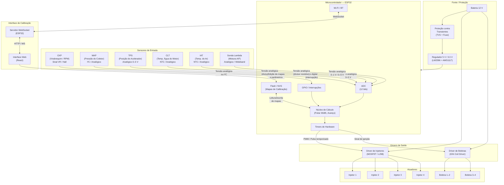

# Diagrama de Blocos do Sistema ECU

Visão geral de todos os blocos do hardware e suas conexões.

## Descrição dos Blocos

| Bloco | Função | Interface |
|-------|--------|-----------|
| **CKP** | Lê a posição e velocidade do virabrequim via roda fônica | Digital (interrupção de borda) |
| **MAP** | Mede a pressão absoluta do coletor (carga do motor) | Analógico ou I²C |
| **TPS** | Lê a abertura da borboleta (0–100%) | Analógico 0–5 V |
| **CLT** | Mede a temperatura do líquido de arrefecimento | NTC → divisor resistivo → ADC |
| **IAT** | Mede a temperatura do ar admitido | NTC → divisor resistivo → ADC |
| **Sonda Lambda** | Mede a mistura ar-combustível para controle em malha fechada | Analógico (NBO2) ou protocolo wideband |
| **ESP32** | Microcontrolador principal — lê sensores, calcula e aciona saídas | — |
| **Driver Injetores** | Amplifica o sinal do ESP32 para acionar solenoides de alta corrente | PWM → MOSFET → Injetor |
| **Driver Bobinas** | Gera o pulso de ignição nas bobinas (CDI/IGN) | Sinal digital → Driver dedicado |
| **Regulador** | Converte 12 V da bateria para 5 V e 3,3 V | LM2596 (5 V) + AMS1117 (3,3 V) |
| **Interface Web** | Permite editar mapas de calibração em tempo real via browser | Wi-Fi → WebSocket |
